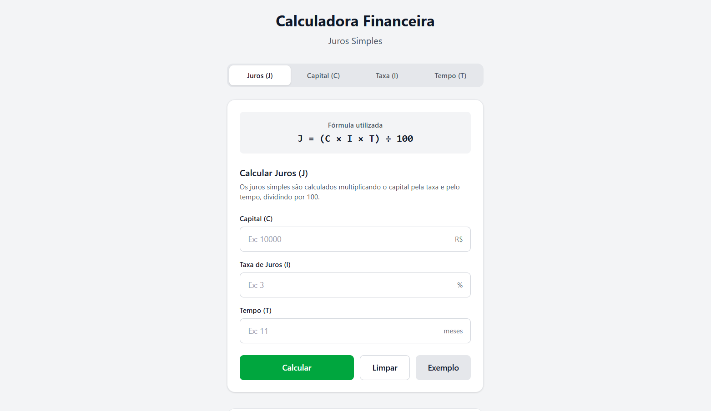

# Calculadora Financeira — Juros Simples



#### Projeto de faculdade: calculadora de juros simples construída com React + Vite

## Descrição

Aplicação web simples para calcular juros simples. Permite inserir capital, taxa de juros e período, e exibe o valor dos juros e o montante final.

## Tecnologias

- React (JSX)
- Vite
- HTML / CSS

## Instalação

1. Clone o repositório:

```bash
git clone <url-do-repositorio>
cd TDE2-Calculadora_Financeira_Juros_Simples
```

2. Instale dependências:

```bash
npm install
```

## Execução (desenvolvimento)

Inicie o servidor de desenvolvimento com:

```bash
npm run dev
```

Abra o navegador em http://localhost:5173 (ou porta indicada pelo Vite).

## Uso

- Preencha os campos na interface: capital, taxa de juros (em % ao período) e número de períodos.
- Clique em "Calcular" para ver os juros simples e o montante final.

## Estrutura do projeto

- `src/` — código-fonte
  - `components/CalculatorForm.jsx` — formulário e lógica de cálculo
  - `pages/Index.jsx` — página inicial
  - `App.jsx`, `main.jsx` — bootstrap da aplicação

## Responsáveis

> **Integrantes:** Leandro Maciel Giovani / Luiz Gustavo Arduino Batista / Ronaldo Silva Nogueira Batista / Thiago Zaneti dos Santos / Vinícius Yuichi Tutya

> **Professor:** Luiz Henrique Morais da Silva